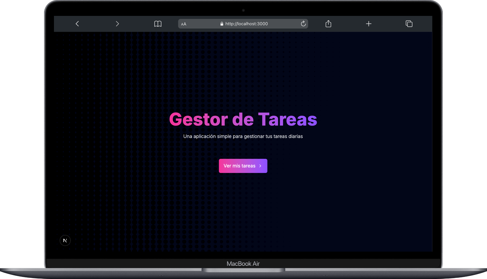
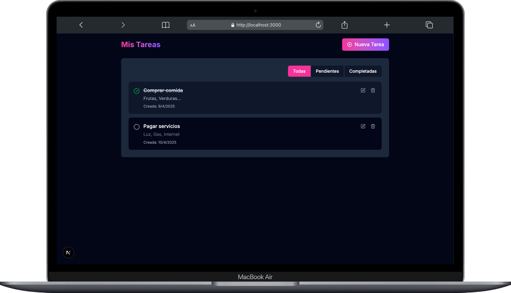
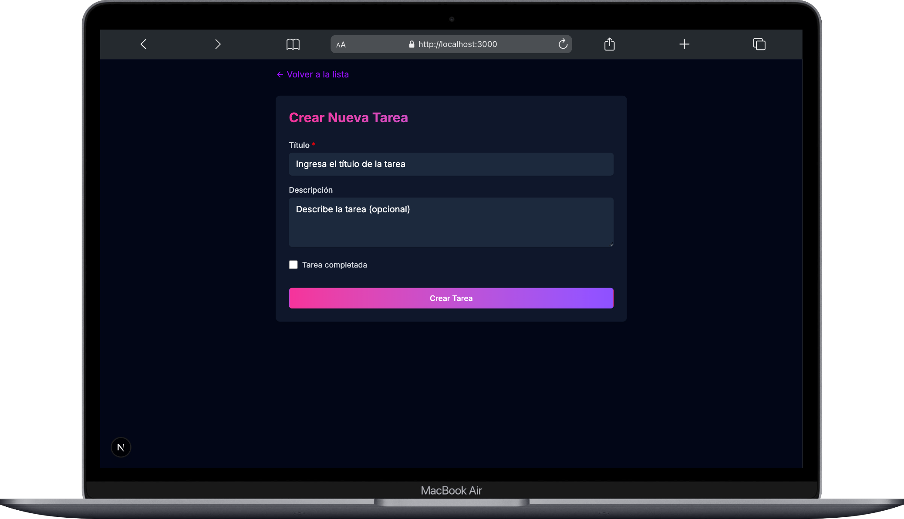

# Gestor de Tareas - Frontend

Este es el frontend de la aplicación de gestión de tareas desarrollada como parte del desafío de ingreso a la Academia ForIT 2025. Esta aplicación permite a los usuarios crear, ver, editar y eliminar tareas, así como marcarlas como completadas.



## Tecnologías Utilizadas

- **Next.js 14**: Framework de React con renderizado del lado del servidor
- **TypeScript**: Para tipado estático y mejor desarrollo
- **TailwindCSS**: Para estilos y diseño responsive
- **SweetAlert2**: Para diálogos y notificaciones mejoradas
- **Lucide React**: Para iconos

## Características Implementadas

- ✅ Listado de tareas con filtros (todas/pendientes/completadas)
- ✅ Creación de nuevas tareas
- ✅ Edición de tareas existentes
- ✅ Eliminación de tareas
- ✅ Marcado de tareas como completadas/pendientes
- ✅ Validación de formularios
- ✅ Notificaciones y confirmaciones con SweetAlert2
- ✅ Diseño responsive para móviles y escritorio
- ✅ Favicon personalizado

## Requisitos Previos

Antes de comenzar, asegúrate de tener instalado:

- Node.js (v16 o superior)
- npm o yarn
- El backend de la aplicación debe estar en ejecución (ver instrucciones en el README del backend)

## Instalación y Ejecución

Sigue estos pasos para configurar y ejecutar el frontend localmente:

1. **Clonar el repositorio** (si aún no lo has hecho):

   ```bash
   git clone https://github.com/DeniseAguirre/task-manager-frontend.git
   cd task-manager-frontend
   ```

2. **Instalar dependencias**:

```shellscript
npm install
# o si prefieres yarn
yarn
```


3. **Configurar variables de entorno**:

```shellscript
cp .env.example .env
```

Asegúrate de que la variable `NEXT_PUBLIC_API_URL` apunte a la URL correcta del backend (por defecto: `http://localhost:3001/api`).


4. **Iniciar el servidor de desarrollo**:

```shellscript
npm run dev
# o si prefieres yarn
yarn dev
```


5. **Acceder a la aplicación**:
Abre tu navegador y visita `http://localhost:3000`


## Estructura del Proyecto

```
frontend/
├── public/                # Archivos estáticos (favicon, etc.)
├── src/
│   ├── app/               # Rutas de Next.js App Router
│   │   ├── page.tsx       # Página principal
│   │   ├── tasks/         # Rutas relacionadas con tareas
│   │   │   ├── page.tsx   # Lista de tareas
│   │   │   ├── new/       # Crear nueva tarea
│   │   │   └── [id]/      # Editar tarea existente
│   ├── components/        # Componentes reutilizables
│   │   ├── TaskForm.tsx   # Formulario para crear/editar tareas
│   │   ├── TaskItem.tsx   # Componente de tarea individual
│   │   └── TaskList.tsx   # Lista de tareas
│   ├── lib/               # Utilidades y servicios
│   │   ├── api.ts         # Funciones para comunicarse con la API
│   │   └── swal.ts        # Configuración de SweetAlert2
│   └── globals.css        # Estilos globales (Tailwind)
├── .env.example           # Ejemplo de variables de entorno
├── next.config.mjs        # Configuración de Next.js
├── package.json           # Dependencias y scripts
├── tailwind.config.ts     # Configuración de Tailwind CSS
└── tsconfig.json          # Configuración de TypeScript
```

## Screenshots

A continuación se muestran capturas de pantalla de la aplicación en funcionamiento:

### Página Principal


*Página de inicio de la aplicación*

### Lista de Tareas



*Vista de la lista de tareas con filtros*

### Formulario de Creación



*Formulario para crear una nueva tarea*


## Integración con el Backend

Esta aplicación frontend se comunica con un backend desarrollado en NestJS que proporciona una API RESTful para la gestión de tareas. Asegúrate de que el backend esté en ejecución antes de utilizar esta aplicación.

## Despliegue

Para construir la aplicación para producción:

```shellscript
npm run build
# o si prefieres yarn
yarn build
```

Para iniciar la aplicación en modo producción:

```shellscript
npm run start
# o si prefieres yarn
yarn start
```

## Autor

Denise Aguirre Martinez

## Licencia

Este proyecto está licenciado bajo la Licencia MIT.


   
